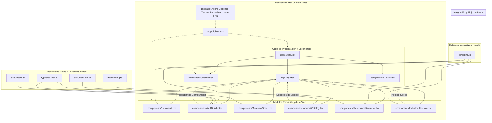

# GRAPHIFY — BunkerLock Architecture & Component Dependency Graph

## Registro de Componentes y Estado

| Módulo / Archivo | Responsabilidad | Dependencias Principales | Estado |
| :--- | :--- | :--- | :--- |
| `app/globals.css` | Design System Skeuomórfico (acero cepillado, titanio, biseles, remaches, reflejos, tiras de peligro) | Tailwind CSS v4 | **Completado** |
| `app/layout.tsx` | Fuentes industriales Google (`Space Grotesk`, `Inter`, `JetBrains Mono`) y metadatos SEO | Next.js Metadata | **Completado** |
| `lib/sound.ts` | Motor de audio táctil sintetizado con Web Audio API nativo (latches, pernos, clics, scans) | Web Audio API | **Completado** |
| `types/bunker.ts` | Modelos de datos TypeScript de blindaje, cerraduras, acabados y ensayos | TypeScript | **Completado** |
| `data/doors.ts` | Especificaciones de 5 niveles de blindaje, 3 cerraduras y 4 acabados exteriores | Types | **Completado** |
| `data/ironwork.ts` | Catálogo de portones acorazados, rejas de forja maciza y habitaciones de pánico | Types | **Completado** |
| `data/testing.ts` | Ensayos de laboratorio (balística 7.62 NATO, amoladora 230mm, presión hidráulica, fuego EI 120) | Types | **Completado** |
| `components/Navbar.tsx` | Barra de estado industrial táctil con status LED, telemetría y audio toggle | Lucide, Sound | **Completado** |
| `components/HeroVault.tsx` | "La Cámara de Seguridad": Puerta interactiva con cerrojos físicos y volante de bóveda accionable | Sound | **Completado** |
| `components/VaultBuilder.tsx` | Configurador interactivo con cálculo de peso, grosor y presupuesto en tiempo real | Types, Doors Data, Sound | **Completado** |
| `components/AnatomyScroll.tsx` | Desglose anatómico por capas del sándwich balístico | Sound | **Completado** |
| `components/IronworkCatalog.tsx` | Catálogo táctil de herrería pesada con filtros interactivos | Ironwork Data, Sound | **Completado** |
| `components/ResistanceSimulator.tsx` | Simulador interactivo de impacto balístico, deformación y fuego con dictamen | Testing Data, Sound | **Completado** |
| `components/IndustrialConsole.tsx` | Consola industrial de cotización y despacho directo por WhatsApp | Sound | **Completado** |
| `components/Footer.tsx` | Sellos de certificación (EN 1627, RB3), garantía estructural y planta industrial | Lucide, Sound | **Completado** |
| `app/page.tsx` | Orquestación central de módulos y enlace de estado entre configurador y consola | Componentes Core | **Completado** |
