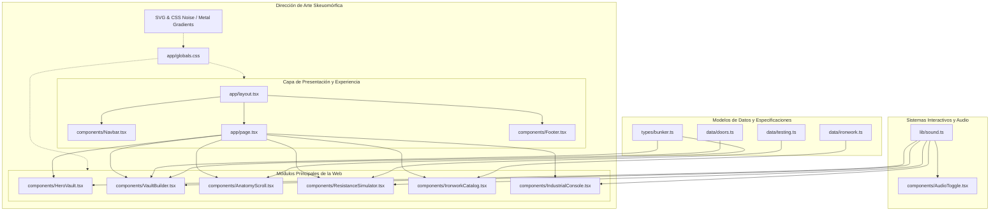

# GRAPHIFY — BunkerLock Architecture & Component Dependency Graph

## Registro de Componentes y Estado

| Módulo / Archivo | Responsabilidad | Dependencias Principales | Estado |
| :--- | :--- | :--- | :--- |
| `app/globals.css` | Design System Skeuomórfico (acero cepillado, titanio, biseles, remaches, reflejos) | Tailwind CSS v4 | En desarrollo |
| `lib/sound.ts` | Motor de audio táctil sintetizado mediante Web Audio API (latches, clicks, alarmas, pernos) | Web Audio API nativo | Planificado |
| `types/bunker.ts` | Tipos TypeScript de blindaje, cerraduras, herrería y presupuestación | TypeScript | Planificado |
| `components/Navbar.tsx` | Barra de estado industrial táctil con status LED y acceso rápido | Lucide, Sound | Planificado |
| `components/HeroVault.tsx` | "La Cámara de Seguridad": Puerta interactiva con cerrojos mecánicos móviles | Framer Motion, Sound | Planificado |
| `components/VaultBuilder.tsx` | Configurador interactivo con cálculo de peso, grosor y presupuesto en tiempo real | Types, Sound | Planificado |
| `components/AnatomyScroll.tsx` | Desglose anatómico scrollytelling de las 5 capas de blindaje | Framer Motion | Planificado |
| `components/ResistanceSimulator.tsx` | Simulador interactivo de impacto balístico, radial y fuego | Sound, Testing Data | Planificado |
| `components/IronworkCatalog.tsx` | Catálogo táctil de herrería pesada de alta precisión | Iron Data | Planificado |
| `components/IndustrialConsole.tsx` | Consola de control industrial para contacto y cotización instantánea | Sound, Types | Planificado |
| `components/Footer.tsx` | Sellos normativos, garantía de por vida y especificaciones técnicas | Lucide | Planificado |
